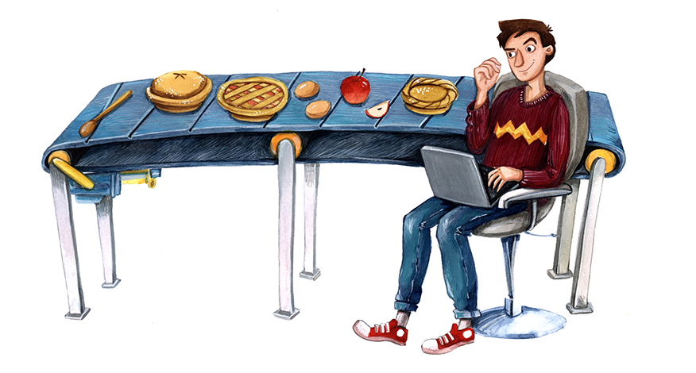

# Python from Scratch LiveLessons

This an interactive guided tour of the Python programming language. For those who love cooking-class style instructional videos or for those who just love pie, *Python from Scratch LiveLessons* will whet your appetite for learning the Python programming language.

Regardless of whether this is your very first lesson in programming or if you just need a refresher, *Python from Scratch LiveLessons* will cover the fundamental concepts common to every Python use case. You may want to program your fish tank 🐠 or our next interstellar spacecraft 🚀.  *Python from Scratch LiveLessons* will provide a fun and easy to follow tutorial that will leave you hungry for more.

You can execute Python code in this notebook as we go along. This platform is the chef's kitchen. Now let's bake!

